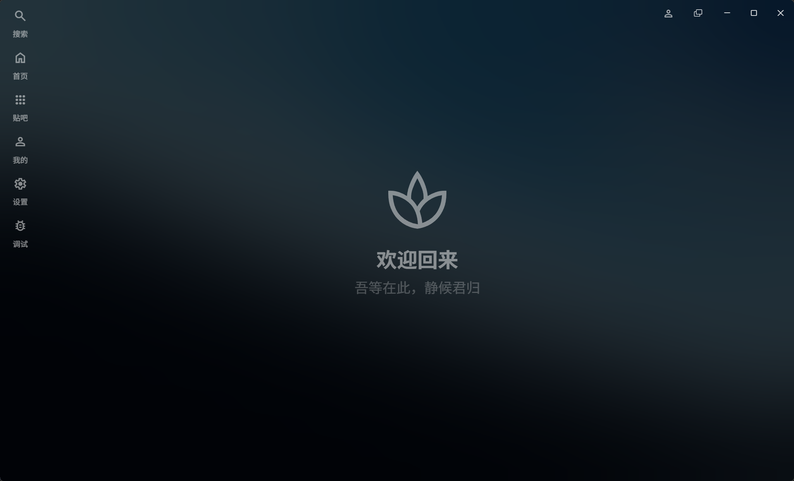
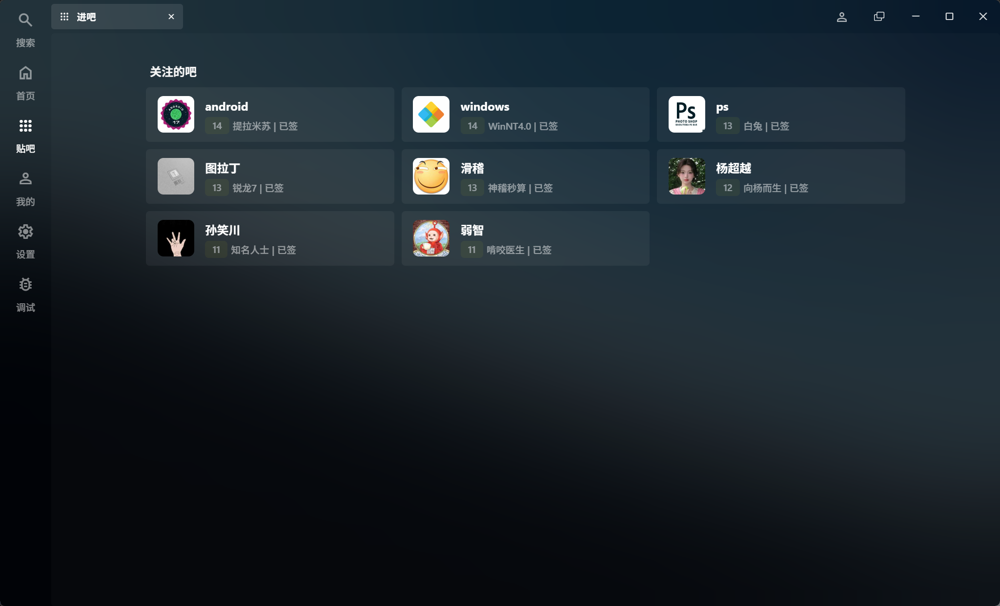
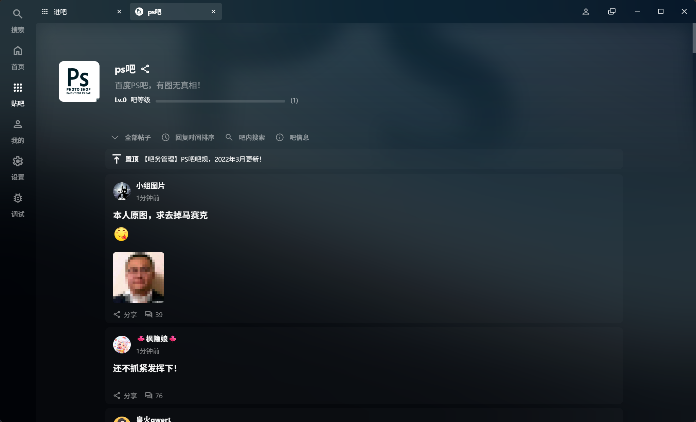
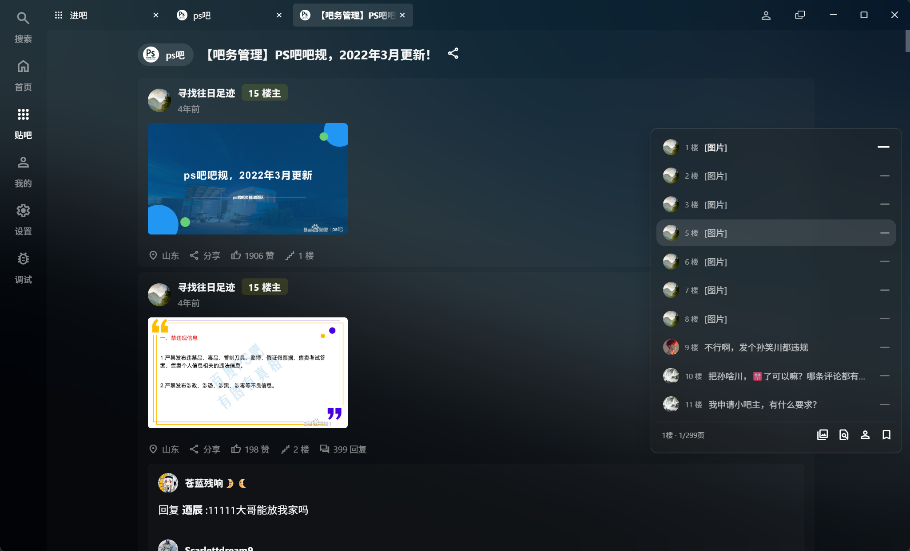

# NeoTieba

吾等在此，静候君归

    

基于 `Tauri2.0` + `Vue3` + `TypeScript` 构建的 **非官方** 贴吧客户端, 适用于桌面端应用, 缓速更新中……

NeoTieba 以开放的态度开发, 欢迎提交 PR 以及相关探索. 感谢支持.

> [!warning]
>
> **本程序不会收集你的任何个人信息.**
>
> **此软件仅供学习交流使用, 严禁用于商业用途. 出现的任何后果作者概不负责！**
>
> 迫于学业压力, 更新~~可能~~会很缓慢 :(

## 📷 界面与功能预览

|         欢迎         |         进吧         |
| :------------------: | :------------------: |
|  |  |
| **看吧** | **看帖** |
|  |  |

> [!important]
>
> 项目侧重于看帖, 因此, 回帖、发帖等重互动型操作均不在计划内. 同时也建议使用官方客户端/网页进行此类操作, 以免封号.

## 🐛 尝鲜与调试

本项目依托 GitHub Actions 编译. 共两个构建脚本:

| 脚本与链接                                                   | 触发方式           | 是否发布 Releases 页 | 备注                                                    |
| ------------------------------------------------------------ | ------------------ | -------------------- | ------------------------------------------------------- |
| [Prerelease](https://github.com/Vkango/NeoTieba/actions/workflows/prerelease.yml) | 由维护人员手动触发 | 是​                   | 供大多数人测试使用                                      |
| [Test Build](https://github.com/Vkango/NeoTieba/actions/workflows/test-build.yml) | 每次提交后自动触发 | 否                   | 最新构建, 不能确保稳定性, 每次构建后 30 天会被自动删除. |

> [!note]
>
> 当前发布构建仍以 Windows 为主.
>
> Linux + macOS 构建仍在测试中, 无法保证稳定性.

> [!note]
> 
> 在以下平台进行了使用测试:
> 
> Windows: Windows 11 x64、Windows 11 arm64
> 
> Linux: Ubuntu 26.04 LTS x64
>
> macOS: macOS 27 Golden Gate (arm64)

### 登录方法

前往 `设置` → `账号管理` 添加账户. 支持扫码登录, 浏览器登录和 Cookie 登录.

如需使用 Cookie 登录, 请用本机浏览器登录百度贴吧网页版, 使用开发者工具抓取数据包, 得到 BDUSS 与 STOKEN 并填写到对话框.

如需扫码登录, 建议使用百度网盘扫码.

### 调试

确保具备最新的 Tauri 应用调试环境.

安装包依赖: `pnpm install`

运行 Dev 版: `pnpm tauri dev`

构建发布版: `pnpm tauri build`

## 🥰 支持

### 鸣谢

我想成为一个温柔的人， 因为曾被温柔的人那样对待过，深深了解那种被温柔相待的感觉。

个人能力有限, 项目尚有许多不成熟之处.

感谢所有贡献者的倾力支持, 也感谢每一位试用软件、提出反馈、与我交流的朋友. 能在这里遇见你们的善意, 是这个项目最大的幸运.

谢谢你们. ❤

### 友情链接

贴吧 Lite, 优秀的第三方贴吧 Android 客户端: [HuanCheng65/TiebaLite: 贴吧 Lite](https://github.com/HuanCheng65/TiebaLite)

TiebaDesktop, 优秀的第三方贴吧桌面客户端: [clb-128258/TiebaDesktop: 非官方的百度贴吧电脑客户端，目前支持 Windows 系统](https://github.com/clb-128258/TiebaDesktop)

### 引用及参考

本项目参考了以下项目 (或页面) 提供的源码: 

|    [贴吧 Lite](https://github.com/HuanCheng65/TiebaLite)     |  [TiebaDesktop](https://github.com/clb-128258/TiebaDesktop)  | [tbclient.protobuf](https://github.com/n0099/tbclient.protobuf) |
| :----------------------------------------------------------: | :----------------------------------------------------------: | :----------------------------------------------------------: |
|       [aiotieba](https://github.com/lumina37/aiotieba)       | [解读keep-alive](https://www.cnblogs.com/shanfeng1000/p/16692266.html) |      [Material Symbols](https://fonts.google.com/icons)      |
|                   [Vue](https://vuejs.org)                   |                   [Vite](https://vite.dev)                   |                  [Tauri](https://tauri.app)                  |
|               [Pinia](https://pinia.vuejs.org)               |         [TypeScript](https://www.typescriptlang.org)         |                  [Tokio](https://tokio.rs)                   |
| [pinia-plugin-persistedstate](https://github.com/cwahls/pinia-plugin-persistedstate) |             [esbuild](https://esbuild.github.io)             |      [Reqwest](https://github.com/seanmonstar/reqwest)       |
|        [CryptoJS](https://github.com/brix/crypto-js)         |      [vue-tsc](https://github.com/vuejs/language-tools)      |                  [Serde](https://serde.rs)                   |
|       [DOMPurify](https://github.com/cure53/DOMPurify)       | [unplugin-auto-import](https://github.com/antfu/unplugin-auto-import) |          [Prost](https://github.com/tokio-rs/prost)          |
|   [html-to-image](https://github.com/bubkoo/html-to-image)   | [unplugin-vue-components](https://github.com/antfu/unplugin-vue-components) |      [thiserror](https://github.com/dtolnay/thiserror)       |
|                [Tauri API](https://tauri.app)                |      [memmap2](https://docs.rs/memmap2/latest/memmap2/)      | [window-vibrancy](https://github.com/tauri-apps/window-vibrancy) |
