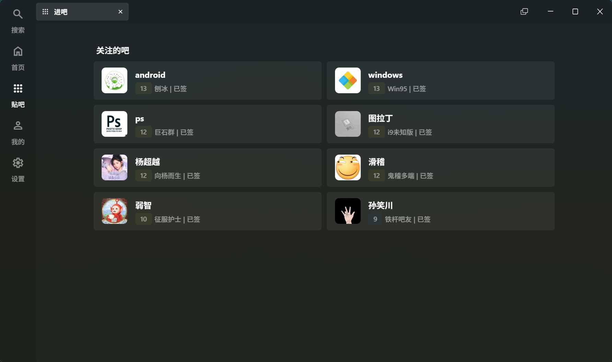
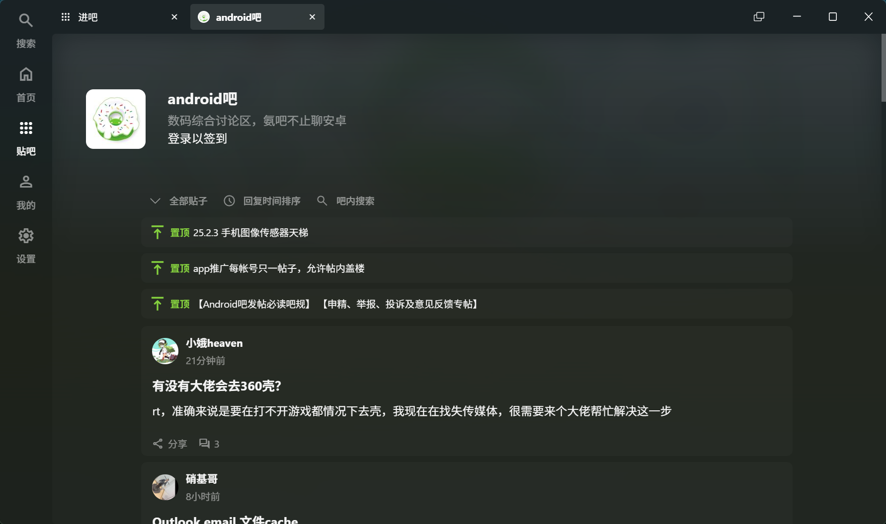

<p align="center">

</p>
<div align="center">


# NeoTieBa

基于 `Tauri` + `Vue3` 构建的 **非官方** 贴吧客户端, 适用于桌面端应用, 缓速更新中……

</div>

> [!warning]
>
> 本程序**不会**收集你的任何个人信息. 
>
> **此软件仅供学习交流使用, 严禁用于商业用途. 出现的任何后果作者概不负责！**
>
> 迫于学业压力, 更新~~可能~~会很缓慢 :(


## 🐛 提前尝鲜

可以从 GitHub Actions 中下载尝鲜版. 请前往 Actions → 最新一条成功的Test Build → Artifacts 下载对应平台应用. 

**注意: 每次构建后30天自动删除. **

**目前 Build 版问题较多, 因学业原因无法及时修复, 请谅解. 在开始时自动弹出错误提示无用户登录, 单击报错通知即可打开扫码登录. 建议使用百度网盘扫码. **

如果仍登录失败 (例如无法加载二维码), 刷新仍无法解决, 可以尝试前往软件目录, 手动新建 `users.json` 文件使用Cookies登录. 

内容像这样: 

```json
[
  {
    "user_name": "xxxxx",
    "avatar": "https:\\/\\/himg.bdimg.com\\/sys\\/portrait\\/item\\/xxxxxxx.jpg",
    "bduss": "xxxxxxxx",
    "stoken": "xxxxxxxxx",
    "current": true
  }
]
```

或者, 如果具备 Tauri 应用调试环境, 可运行 Dev 版: `npm run tauri dev` 或手动编译:  `npm run tauri build`

添加你的账号: 设置-账号列表-扫码登录. 

扫码登录可使用支持扫码的任意百度旗下产品: 贴吧、网盘、百度客户端等. 


## 🚀 功能支持 (待办事项)

### ➡️ 登录

- [x] 扫码登录
- [ ] 直接使用 Cookie 登录
- [ ] 内置浏览器登录

### 📄 页面

#### 贴子、贴吧相关

- [x] 浏览贴吧
- [x] 浏览贴子
- [x] 浏览楼中楼

#### 首页相关

- [ ] 首页推荐

#### 用户相关

- [x] 用户主页
- [ ] 历史记录
- [x] 收藏

#### 搜索相关

- [x] 搜索页

#### 程序相关

- [ ] 设置
- [ ] 扩展插件

#### 其他

- [ ] ~~吧务管理~~ (不在计划内, 可能以后会通过插件实现)
- [ ] 保存贴子

### ⚙ 小功能

- [ ] 跳页
- [ ] 签到 (自动签到不在计划内)
- [ ] 赞踩
- [ ] ~~回帖~~ (不在计划内, 如需回帖请使用官方网页/客户端, 以免封号)
- [ ] ~~发帖~~ (不在计划内, 如需发帖请使用官方网页/客户端, 以免封号)

### 🎗️ 组件

- [x] Tab 自由拖拽与动画
- [ ] 内建 + 系统 通知系统


## 👀 视觉 & 体验

- [x] 亮主题
- [x] 暗主题
- [x] Mica 材质 (仅适用于 Windows 11)
- [x] Acrylic 材质 (仅适用于 Windows 10+)
- [ ] 无网、加载失败提示


## 💧 感谢

本项目参考了以下项目(或页面)提供的源码: 

[HuanCheng65/TiebaLite: 贴吧 Lite](https://github.com/HuanCheng65/TiebaLite)

[n0099/tbclient.protobuf: 从 244 个历史版本百度贴吧客户端中提取出的所有 Protocol Buffers 定义文件 `.proto`](https://github.com/n0099/tbclient.protobuf)

[lumina37/aiotieba: 贴吧接口合集✨可用于工具箱/吧务管理/数据采集](https://github.com/lumina37/aiotieba)

[解读keep-alive: Vue3中手动清理keep-alive组件缓存的一个解决方案 - 没有星星的夏季 - 博客园](https://www.cnblogs.com/shanfeng1000/p/16692266.html)

[Material Symbols & Icons - Google Fonts](https://fonts.google.com/icons)


## 📷 运行截图







