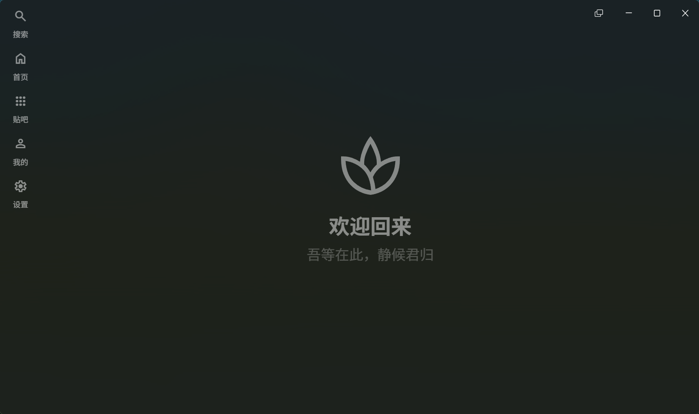

# NeoTieBa

吾等在此，静候君归

  

基于 `Tauri2.0` + `Vue3` + `TypeScript` 构建的 **非官方** 贴吧客户端, 适用于桌面端应用, 缓速更新中……

NeoTieBa 以开放的态度开发, 欢迎提交 PR 以及相关探索. 感谢支持.

> [!warning]
>
> **本程序不会收集你的任何个人信息.**
>
> **此软件仅供学习交流使用, 严禁用于商业用途. 出现的任何后果作者概不负责！**
>
> 迫于学业压力, 更新~~可能~~会很缓慢 :(

## 🐛 尝鲜与调试

可以从 GitHub Actions 中下载尝鲜版. 请前往 `Actions` → 最新一条成功的 `Test Build` → `Artifacts` 下载对应平台应用. 

> [!note]
>
> 目前暂时没有除 Windows 端以外其他端的移植计划.

> [!warning]
>
> 每次构建后30天自动删除.
>
> 目前尝鲜版问题较多, 因学业原因无法及时修复, 请谅解.

### 登录方法

前往 `设置` → `账号管理` 添加账户. 建议使用百度网盘扫码.

### 调试

确保具备最新的 Tauri 应用调试环境. 使用 `npm run tauri dev` 来运行 Dev 版, 使用 `npm run tauri build` 进行应用构建.

## 🚀 功能支持 (待办事项)

### ➡️ 登录

- [x] 扫码登录
- [x] 直接使用 Cookie 登录
- [x] 内置浏览器登录

### 📄 页面

#### 贴子、贴吧相关

- [x] 浏览贴吧
- [x] 浏览贴子
- [x] 浏览楼中楼

#### 首页相关

- [x] 首页推荐

#### 用户相关

- [x] 用户主页
- [ ] 历史记录
- [x] 收藏

#### 搜索相关

- [x] 搜索页
- [x] 吧内搜索

#### 程序相关

- [ ] 设置
- [ ] 扩展插件

#### 其他

- [ ] ~~吧务管理~~ (不在计划内, 可能以后会通过插件实现)
- [ ] 保存贴子

### ⚙ 体验

- [ ] 跳页
- [ ] 签到 (自动签到不在计划内)
- [ ] 赞踩
- [ ] ~~回帖~~ (不在计划内, 如需回帖请使用官方网页/客户端, 以免封号)
- [ ] ~~发帖~~ (不在计划内, 如需发帖请使用官方网页/客户端, 以免封号)

### 🎗️ 组件

- [x] Tab 自由拖拽与动画
- [ ] 内建 + 系统 通知系统

## 👀 视觉 & 体验

- [x] 亮主题
- [x] 暗主题
- [x] Mica 材质 (仅适用于 Windows 11)
- [x] Acrylic 材质 (仅适用于 Windows 10+)
- [ ] 无网、加载失败提示

## 💧 感谢

本项目参考了以下项目(或页面)提供的源码: 

[HuanCheng65/TiebaLite: 贴吧 Lite](https://github.com/HuanCheng65/TiebaLite)

[n0099/tbclient.protobuf: 从 244 个历史版本百度贴吧客户端中提取出的所有 Protocol Buffers 定义文件 `.proto`](https://github.com/n0099/tbclient.protobuf)

[lumina37/aiotieba: 贴吧接口合集✨可用于工具箱/吧务管理/数据采集](https://github.com/lumina37/aiotieba)

[解读keep-alive: Vue3中手动清理keep-alive组件缓存的一个解决方案 - 没有星星的夏季 - 博客园](https://www.cnblogs.com/shanfeng1000/p/16692266.html)

[Material Symbols & Icons - Google Fonts](https://fonts.google.com/icons)

## 🔗 友情链接

贴吧 Lite, 优秀的第三方贴吧 Android 客户端: [HuanCheng65/TiebaLite: 贴吧 Lite](https://github.com/HuanCheng65/TiebaLite)

TiebaDesktop, 优秀的第三方贴吧桌面客户端: [clb-128258/TiebaDesktop: 非官方的百度贴吧电脑客户端，目前支持 Windows 系统](https://github.com/clb-128258/TiebaDesktop)

## 📷 运行截图

